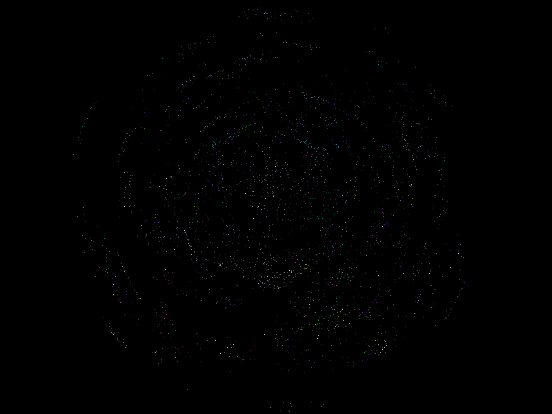
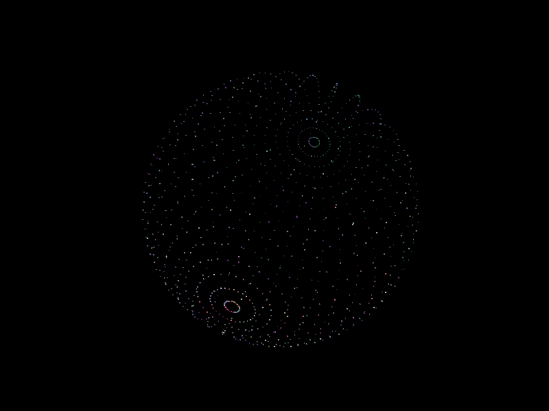
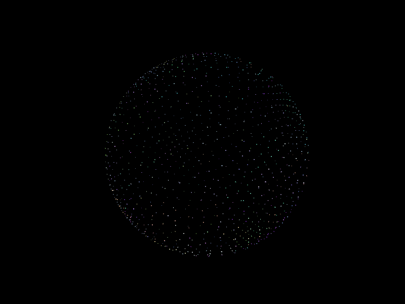
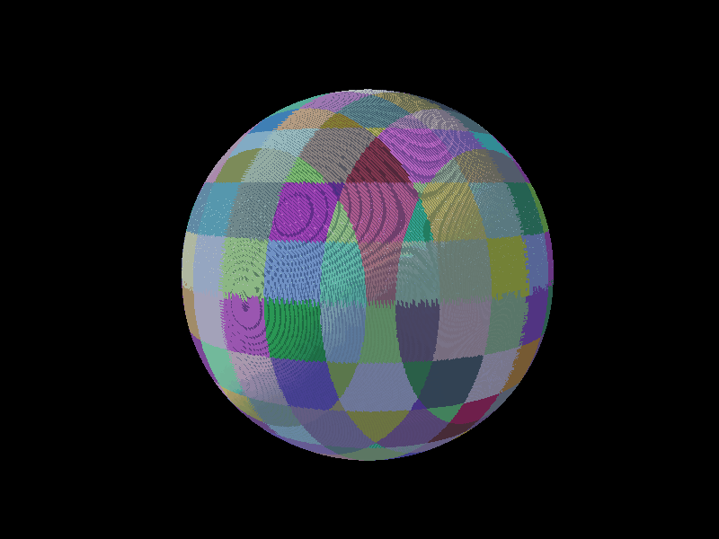
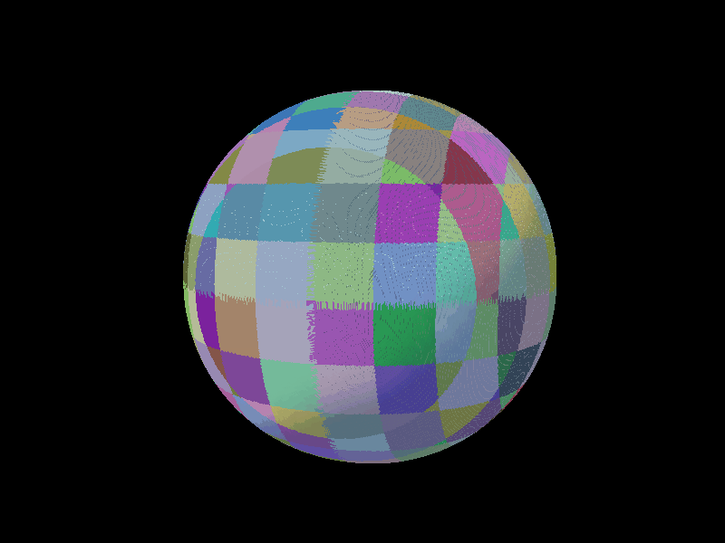
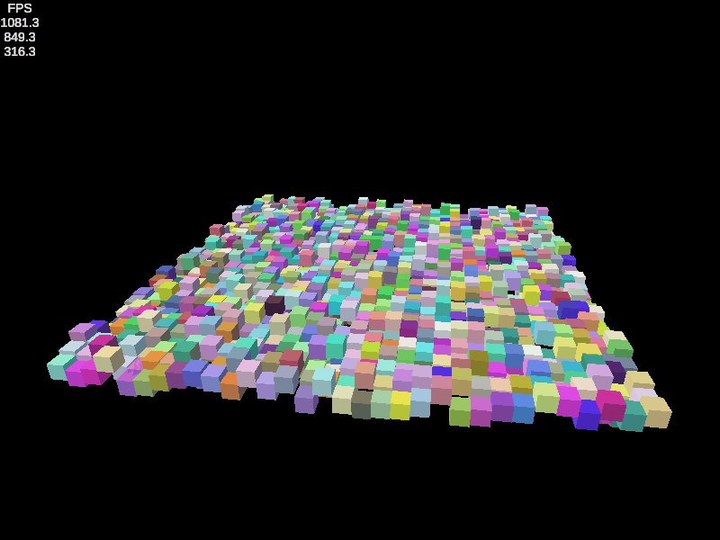
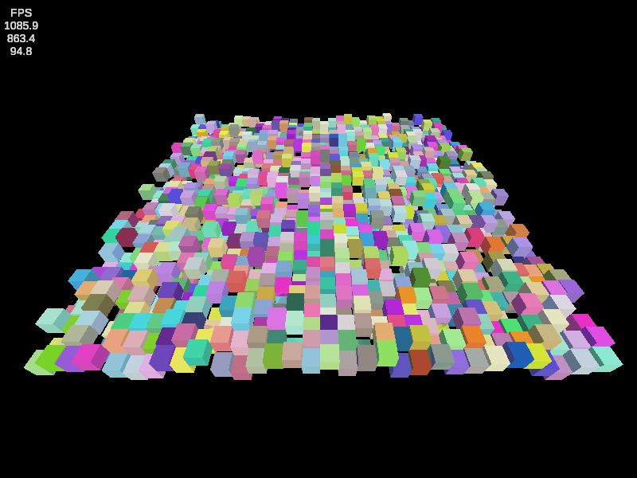

# My-Unity-Noise
My implementations of various pseudorandom noise generation algorithms in Unity. Adapted for the default render pipeline from Jasper Flick's URP demos on pseudorandom noise from <a href="https://catlikecoding.com/">Catlike Coding</a>. My implemenations may serve as a reference for learners to compare their own projects to, especially those who want to write HLSL shaders rather than utilize the Universal Render Pipeline with Shader Graph.
## Spacial Hashing

| UV Sphere | Octahedron Sphere |
| :---: | :---: |
|  |  |
|  |  |

A UV sphere and octahedron sphere, both procedurally generated spheres using different approaches. The UV sphere consists of concentric rings with greater radii towards the equator and smaller radii towards the poles. This creates a nonuniform distribution of points, which cluster at poles and spread out towards the equator. The octahedron sphere utilizes an octahedron, a plane wrapped around certain axes, scaled down to the shape of a sphere. Points cluster in the six corners of the octahedron, but the distribution of points overall is more uniform. The difference in approaches is most visible when there are fewer points.

## xxHash

Utilizes an <a href="https://github.com/Cyan4973/xxHash/blob/dev/doc/xxhash_spec.md">xxHash</a> by Yann Collet to create noise. 